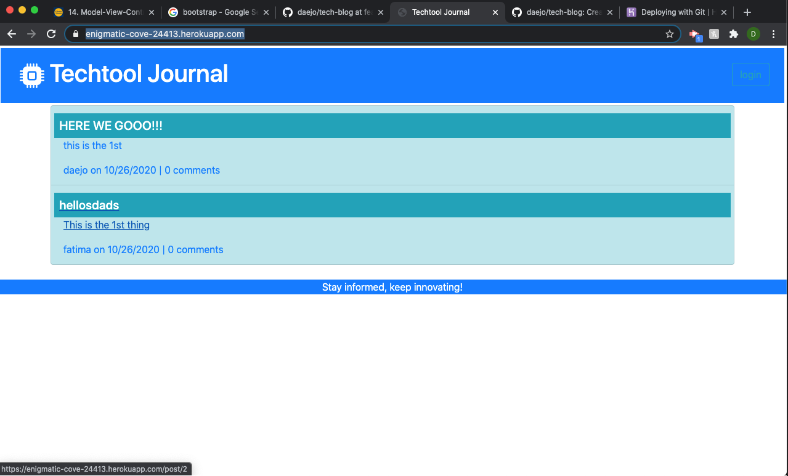

# Tech-Blog
  
  
  

  ## Description 

  _Create new blog entries in this simple blog tech journal. Share new tech, discuss improvements to old ones, meet people with the same interest and create your community in this new blog spot._
 
  ## Table of Contents

  * [Usage](#usage)
  * [Dependencies](#dependencies)
  * [Screenshot](#screenshot)
  * [Questions](#questions)

  ## Usage 

  * Open opening app you will be presented with the blog website.
  * You can browse through the entries or you can login/signup.
  * If you choose to sign-up/login you will asked for login/sign-up details.
  * Once loggin in you can cotinue on adding a new post or commenting on existing ones.  
  

  ## Dependencies

  _"bcrypt": "^5.0.0",  
    "bootstrap": "^4.5.3",  
    "connect-session-sequelize": "^7.0.4",  
    "dotenv": "^8.2.0",  
    "express": "^4.17.1",  
    "express-handlebars": "^5.2.0",  
    "express-session": "^1.17.1",  
    "mysql2": "^2.2.5",  
    "sequelize": "^6.3.5"_

  ## Screenshot

  ---
  ## Questions?
  _Contact me:_
  _[@daejo](github.com/daejo)_  
  _[https://github.com/daejo/tech-blog](https://github.com/daejo/tech-blog)_  
  
